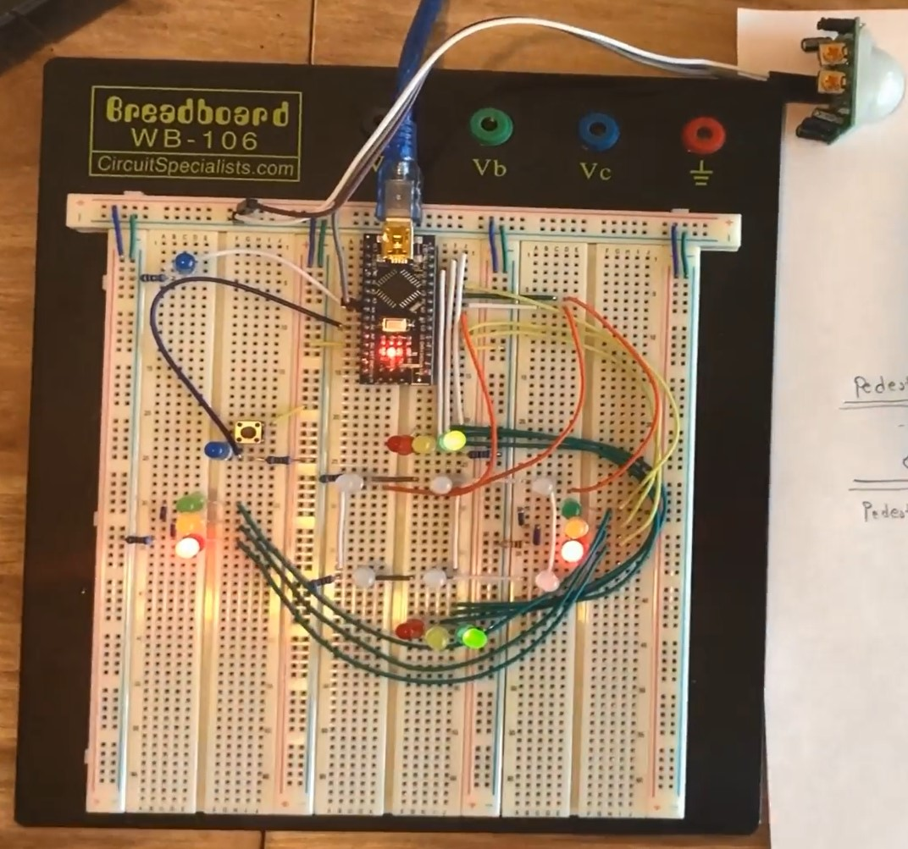

# Arduino Project: Four-Way Traffic Intersection
Introduction:
  The simulation of the Four-Way Traffic Intersection model is successfully tested. In this project, a prototype of Four-Way Traffic intersection is built up that has a main road, an auxiliary road, and a pedestrian pathway. The materials that are used for the project are Arduino Nano ATmega328, a breadboard, a Pir motion detector, a switch, and a bunch of resistors and led lights. In this project, the main road has given the highest priority so that it stays green unless the pedestrian switch button is pushed because it keeps traffic flow smoothly.

#Image of Four-Way Traffic Intersection

Implementation:
-The C++ language is used to accomplish my project.
-Mostly, If and else statements are executed.

Accomplishment:
1 ) When the green light is On and no motion is detected, and at this time if a pedestrian pushes the switch button, then the main road traffic light changes into Red lights after a minimum delay of 5 seconds. At the same time, auxiliary road’s traffic also changes into the green light. 
2 ) When the motion is detected at first, and the pedestrian pushes the switch button, then pedestrian lights will still not be activated until the motion detection turned off. At the same time, auxiliary road’s traffic also remains Red.

Result: 
  The prototype that I built up as a project is very cheap, efficient, and reliable in solving the traffic intersections problems where no traffic lights are installed. Traffic lights installed in the Four-way intersection carries a significant role in saving many lives and property damage from vehicle accidents. The prototype of this project can be used as a prototype on a large scale if opportunities are given.  

